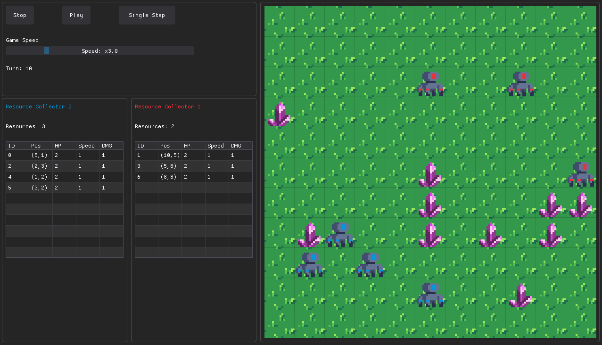

# Bots-Game
A programming game about bots competing against each other

This repository is an improved version of the original project
[Bots Game](https://github.com/Cogno-Marco/Bots-Game) made by
[Cogno-Marco](https://github.com/Cogno-Marco)

Instead of playing using CMD and `.txt` files, you are going to play using a GUI
made in [Dear PyGui](https://github.com/hoffstadt/DearPyGui) and Python

## Objective

The objective of this game is to code your bot and fight against another bot.

## Game Rules

To win the game, you have to do one of this:
- Have more resource than the enemy after 1000 turns;
- Destroy the enemy.

The resources are always 10, they have 3 HP. When you destroy a resource, you get 6 points.
You can spend points:
- creating new troops => it costs 5 points;
- power-up your troops => it costs 3 points.

On your troop, you can power-up health, movement speed or damage (+1).

A single troop, can move, attack or power-up, you can attack enemies or resources.

Each bot can, in the following order:
1. Move each troop once per turn
2. Use each troop to attack enemy troops or resources
3. Improve as many troop statistics as you want, consuming resources in the process. Each troop can be upgraded multiple times, even the same statistic.
4. Spawn 1 new troop per turn, consuming resources in the process. You can control a maximum of 10 troops at the same time.

## Syntax Rule

- If you want to play the game, you have to put your code in the same folder as the `main.py` file (outside of `src/`).

- Your file have to start with `bot_` (Examples: `bot_test.py`, `bot_my_first_bot.py`, `bot_resource_collector.py`, etc.).

- Use the snake case convention to name your file.

## Installing

To install and play the game, simply execute the command `pip install -r requirements.txt`
